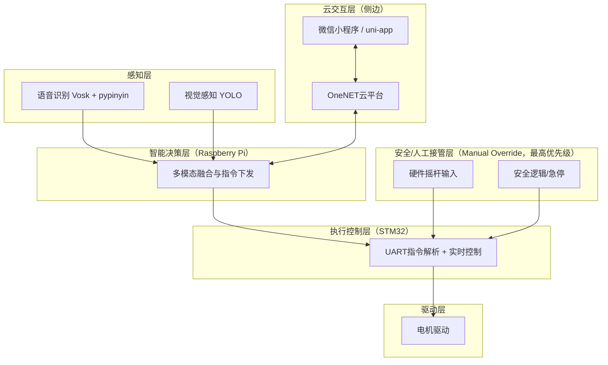

# 基于树莓派与 STM32 的多模态智能语音轮椅系统
### (Multi-modal Smart Voice-Controlled Wheelchair System)

[](https://opensource.org/licenses/MIT)
[](https://www.raspberrypi.org/)
[](https://www.st.com/)

## 🚀 项目简介
本项目是一款为行动不便者设计的智能交互轮椅系统。系统采用 **“端-云-控制”** 三层耦合架构，集成了 **离线语音识别**、**机器视觉避障** 与 **远程物联网监控**。通过树莓派进行高算力的智能感知，由 STM32 实现高实时性的底层动力控制，为用户提供安全、便捷、智能的出行方案。

---

## 🏗️ 系统架构 (System Architecture)
系统采用模块化分层设计，确保了系统的高内聚与低耦合：



1.  **自上而下严格分层：** 感知层 → 智能决策层（Pi）→ 安全/人工接管层 → 执行控制层（STM32）→ 驱动层。
2.  **保留硬件摇杆控制：** 将硬件摇杆放入“安全/人工接管层”，不与普通感知输入混用。
3.  **控制优先级规则：** 硬件摇杆（人工）优先级最高；当摇杆有输入时覆盖语音/视觉/云端控制；无摇杆输入时执行 Pi 下发指令。
4.  **云侧边隔离：** 云平台与小程序仅与 Pi 通信，不直接下发到底层驱动/电机。

---

## 📂 目录结构 (Directory Structure)
```text
Raspberry_SamrtWheelChair/
├── raspberry/              # 树莓派核心：智能感知与交互层
│   ├── vosk_v2.py          # 核心语音处理脚本
│   ├── onenet_mqtt_final.py # 物联网云端通信模块（测试链接用）
│   ├── project/            # 树莓派项目主体代码
│   └── Pi_opencv/          # 在树莓派编译的opencv4.8.0源码库
├── stm32/                  # STM32 核心：硬件驱动与实时控制层
│    WheelchairControl/  # MDK-ARM Keil 工程与驱动代码
├── weixin_app/             # 微信小程序源码
│   └── uni_app/            # 使用uni-app开发
├── docs/                   # 项目文档与答辩资料
└── README.md               # 项目主说明文档
```

---

## ✨ 核心亮点 (Technical Highlights)

*   **🎙️ 鲁棒性语音交互：** 针对老年人或口音用户，集成了**基于拼音相似度的逻辑映射算法**。即便识别出“钱进”而非“前进”，系统仍能通过拼音序列准确匹配指令，显著提升了交互成功率。
*   **📡 端云协同监控：** 利用 `MQTT` 协议实现了毫秒级的远程响应。家属可通过微信小程序实时查看轮椅状态，构建了“使用者+监护者”的双重安全链。
*   **🛠️ 工业级分层设计：** 严格区分高算力模块与实时控制模块。树莓派与 STM32 通过串口通信，保证了系统在处理视觉算法时，底层电机控制不受干扰，满足安全冗余要求。

---

## 🔧 开发环境
*   **Hardware:** Raspberry Pi 4B, STM32, Motor Driver
*   **OS:** Raspberry Pi OS, Windows (for STM32 development)
*   **Tools:** Keil uVision5, VS Code, Python 3.9, OpenCV 4.8.0,HBuilderX,微信开发者工具

---
